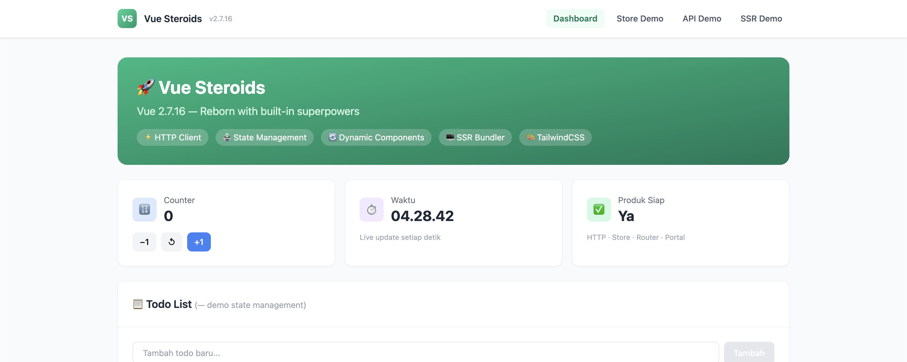

# Vue Steroids — Vue 2.7.16 Diperkaya

> **🍴 Fork dari [vuejs/vue](https://github.com/vuejs/vue) (v2.7.16) dengan fitur modern built-in.**

<p align="center">
  
</p>

<div align="center">


[Fitur](#fitur) • [Mulai Cepat](#-memulai-cepat) • [Dokumentasi](#-dokumentasi) • [Changelog](CHANGELOG.md)

</div>

---

## Ringkasan

Fork ini memperkaya Vue 2.7.16 dengan HTTP client (axios) built-in, state management, WebSocket/Pusher RTC, router, portal/teleport, dynamic component loading, SSR bundling, HMR, storage manager, composables, dan backport Composition API Vue 3 — menghilangkan kebutuhan akan sebagian besar library pihak ketiga sambil mempertahankan 100% kompatibilitas mundur.

---

## Pratinjau

<p align="center">
  
</p>

---

## Fitur

### Masalah

Aplikasi yang dibangun di atas Vue 2 sering membutuhkan banyak library pihak ketiga untuk fungsionalitas modern:

| Kebutuhan | Vue 2 Biasa | Vue Steroids |
|-----------|-------------|--------------|
| HTTP Client | Install axios + setup tiap komponen | `this.get()`, `this.post()` — built-in |
| State Management | Install Vuex | `Vue.config.store` — built-in |
| Router | Install vue-router | `<router-view>` — built-in |
| Real-time Comms | Install pusher-js / laravel-echo | `this.$channel()` — built-in |
| Registrasi Komponen | Harus sebelum `new Vue()` | `Vue.defineDynamicComponent()` — kapan saja |
| Lazy Loading | Dynamic imports manual dengan bundler | Opsi `asyncComponents` |
| Teleport / Portal | Install portal-vue | `<Portal to="target">` — built-in |
| Composition API | Install `@vue/composition-api` | `ref`, `reactive`, `watch` — built-in |

### Solusi

Semua fitur modern ditambahkan langsung ke source code Vue 2 tanpa merusak API yang ada:

| Fitur | Vue 2 Biasa | Vue Steroids |
|-------|-------------|--------------|
| HTTP Client | ❌ Install axios | ✅ **Built-in** (11 method) |
| State Management | ❌ Install Vuex | ✅ **Built-in** (store, getters, mutations, actions) |
| Dynamic Components | ❌ Setup manual | ✅ **Auto-resolve** + register kapan saja |
| Lazy Loading | ❌ Konfigurasi rumit | ✅ **Opsi `asyncComponents`** |
| Registrasi Komponen | ❌ Harus sebelum init | ✅ **`defineDynamicComponent()` kapan saja** |
| SSR Bundling | ❌ Tidak tersedia | ✅ **Bundle komponen dari server** |
| HMR | ❌ Tidak tersedia | ✅ **Hot reload via WebSocket** |

---

## ✨ Fitur Baru

### 1. 🌐 HTTP Client Bawaan (Axios)

Method HTTP tersedia langsung di setiap instance Vue — tanpa perlu import terpisah:

```javascript
new Vue({
  methods: {
    async getUsers() {
      return await this.get('/api/users')
    },
    
    async createUser(data) {
      return await this.post('/api/users', data)
    },
    
    async uploadFile(file) {
      return await this.postForm('/api/upload', { file })
    }
  }
})
```

**Fitur:**
- ✅ 11 method HTTP (get, post, put, patch, delete, head, options, postForm, putForm, patchForm, request)
- ✅ Dukungan Form Data (postForm, putForm, patchForm)
- ✅ Interceptor Request/Response via `Vue.config`
- ✅ Manajemen token otomatis (header Authorization)
- ✅ Callback penanganan error

📖 [Baca dokumentasi lengkap →](docs/steroids/AXIOS_INTEGRATION.md)

---

### 2. 🏪 State Management Bawaan

State management mirip Vuex tanpa perlu package terpisah:

```javascript
// 1. Konfigurasi store global
Vue.config.store = {
  state: {
    count: 0,
    user: null
  },
  getters: {
    isLoggedIn: (state) => !!state.user
  },
  mutations: {
    INCREMENT(state) { state.count++ }
  },
  actions: {
    async fetchUser({ commit }, id) {
      const user = await this.get(`/api/users/${id}`)
      commit('SET_USER', user.data)
    }
  }
}

// 2. Gunakan di komponen
new Vue({
  computed: {
    ...Vue.mapState(['count', 'user']),
    ...Vue.mapGetters(['isLoggedIn'])
  },
  methods: {
    ...Vue.mapMutations(['INCREMENT']),
    ...Vue.mapActions(['fetchUser'])
  }
})
```

**Fitur:**
- ✅ State reaktif dengan auto-update
- ✅ Getters untuk state komputasi
- ✅ Mutations untuk perubahan sinkron
- ✅ Actions untuk operasi asinkron
- ✅ Dukungan modul dengan nesting
- ✅ Fungsi helper (mapState, mapGetters, mapMutations, mapActions)

📖 [Baca dokumentasi lengkap →](docs/steroids/STATE_MANAGEMENT.md)

---

### 3. 🎨 Registrasi Komponen Dinamis

Daftarkan komponen **kapan saja** — bahkan setelah inisialisasi Vue instance:

```javascript
// Dulu: Harus sebelum new Vue()
Vue.component('my-comp', { ... })
new Vue({ ... })

// Sekarang: Daftar kapan saja!
new Vue({ ... })

Vue.defineDynamicComponent('my-comp', {
  template: '<div>Halo!</div>'
})
```

**Fitur:**
- ✅ Daftarkan komponen kapan saja (sebelum atau sesudah `new Vue()`)
- ✅ `$forceUpdate()` otomatis pada semua instance aktif
- ✅ Mendukung kebab-case, camelCase, PascalCase
- ✅ Registry global dibagikan ke semua instance

📖 [Baca dokumentasi lengkap →](docs/steroids/DYNAMIC_COMPONENTS_PERFORMANCE.md)

---

### 4. 📦 Dynamic Component Loader via AJAX

Muat file komponen `.tpl` dari server saat runtime:

```javascript
new Vue({
  methods: {
    async loadComponent() {
      await this.fetchDynamicComponent(
        'input-text',
        '/components/input/input-text',
        'component-notfound'
      )
    }
  }
})
```

**Format File Komponen:**
```html
<!-- /components/input/input-text.tpl -->
<script>
module.exports = {
  data: () => ({ value: '' }),
  methods: {
    onChange(e) { this.value = e.target.value }
  }
}
</script>

<template>
  <input :value="value" @input="onChange" />
</template>
```

**Fitur:**
- ✅ Muat dari server via AJAX
- ✅ Parse otomatis bagian `<script>`, `<template>`, dan `<style>`
- ✅ Daftarkan komponen secara global otomatis
- ✅ Komponen cadangan (fallback) jika gagal muat
- ✅ Callback sukses/error
- ✅ Dukungan muat batch

📖 [Baca dokumentasi lengkap →](docs/steroids/DYNAMIC_COMPONENT_LOADER.md)

---

### 5. 🔄 Komponen Auto-Resolve

Komponen yang belum terdaftar otomatis di-fetch dari server saat `autoFetchComponents` diaktifkan:

```html
<template>
  <div>
    <!-- Komponen belum terdaftar — Vue auto-fetch -->
    <input-text></input-text>
    <!-- Fetch dari: /components/input/input-text.tpl -->
  </div>
</template>
```

**Generasi Path Otomatis:**
```
input-text      →  /components/input/input-text.tpl
button-primary  →  /components/button/button-primary.tpl
header          →  /components/header.tpl
```

**Fitur:**
- ✅ Auto-fetch komponen yang belum terdaftar dari server
- ✅ Auto-parse, daftarkan, dan render ulang
- ✅ Auto `$forceUpdate()` setelah registrasi
- ✅ Komponen fallback jika gagal
- ✅ Pencegahan request duplikat

📖 [Baca dokumentasi lengkap →](docs/steroids/AUTO_RESOLVE_COMPONENTS.md)

---

### 6. ⚡ SSR Bundling (Penggabungan Komponen di Sisi Server)

Gabungkan banyak request file `.tpl` menjadi satu bundle JavaScript dari server:

```javascript
// Aktifkan mode SSR
Vue.config.serverSide = true
Vue.config.serverSideURL = 'http://localhost:8485/bundle'

// Komponen asinkron otomatis di-batch
{
  asyncComponents: [
    '/path/to/heavy-chart',
    '/path/to/data-table',
    '/path/to/map-view'
  ]
}
```

**Cara Kerja:**
1. Client mengumpulkan semua path komponen yang belum dimuat
2. Mengirim satu request POST ke `serverSideURL`
3. Server merespon dengan bundle JS berisi panggilan `Vue.defineDynamicComponent()`
4. Client menginjeksi dan mengeksekusi bundle via **Fetch + Script Injection**
5. Semua komponen terdaftar secara instan

**Fitur:**
- ✅ Batch banyak komponen dalam satu request
- ✅ Caching cerdas — hanya request komponen yang belum dimuat
- ✅ Dynamic Script Injection dengan `sourceURL` untuk debugging DevTools
- ✅ Fallback jika bundle gagal dimuat
- ✅ Kompatibel dengan opsi `asyncComponents`

📖 [Baca dokumentasi lengkap →](docs/steroids/CONFIGURATIONS.md#3-dynamic-component-loader)

---

## 🚀 Memulai Cepat

### Instalasi

```bash
# Install via npm
npm install vue@2.7.16

# Atau gunakan CDN
<script src="https://unpkg.com/vue@2.7.16/dist/vue.js"></script>
```

### Setup Dasar

```html
<!DOCTYPE html>
<html>
<head>
  <!-- Axios sudah termasuk — tidak perlu import terpisah -->
  <script src="./vue.js"></script>
</head>
<body>
  <div id="app">
    <h1>Count: {{ count }}</h1>
    <button @click="increment">+1</button>
  </div>

  <script>
    // 1. Setup store (opsional — tanpa Vuex)
    Vue.config.store = {
      state: { count: 0 },
      mutations: {
        INCREMENT(state) { state.count++ }
      }
    }

    // 2. Buat Vue instance
    new Vue({
      el: '#app',
      computed: {
        count() { return this.$store.state.count }
      },
      methods: {
        increment() {
          this.$store.commit('INCREMENT')
        },
        
        // HTTP request tanpa import axios
        async loadData() {
          const response = await this.get('/api/data')
          console.log(response.data)
        }
      }
    })
  </script>
</body>
</html>
```

---

## 📚 Dokumentasi

| Topik | Deskripsi | Tautan |
|-------|-----------|--------|
| **Konfigurasi Lengkap** | Referensi semua opsi konfigurasi | [Baca →](docs/steroids/CONFIGURATIONS.md) |
| **State Management** | Store bawaan (API mirip Vuex) | [Baca →](docs/steroids/STATE_MANAGEMENT.md) |
| **HTTP Client** | Detail integrasi Axios | [Baca →](docs/steroids/AXIOS_INTEGRATION.md) |
| **Dynamic Components** | Daftarkan komponen kapan saja | [Baca →](docs/steroids/DYNAMIC_COMPONENTS_PERFORMANCE.md) |
| **Component Loader** | Muat komponen .tpl dari server via AJAX | [Baca →](docs/steroids/DYNAMIC_COMPONENT_LOADER.md) |
| **Auto-Resolve** | Pengambilan komponen otomatis sesuai permintaan | [Baca →](docs/steroids/AUTO_RESOLVE_COMPONENTS.md) |
| **Build System** | Pipeline build, generate boilerplate, packing JS | [Baca →](docs/steroids/BUILD_SYSTEM.md) |
| **SSR Bundler** | Server penggabungan komponen di sisi server | [Baca →](docs/steroids/SSR_BUNDLER.md) |
| **Performa** | Tips optimasi | [Baca →](docs/steroids/DYNAMIC_COMPONENTS_PERFORMANCE.md) |
| **Changelog** | Semua perubahan | [Baca →](CHANGELOG.md) |

---

## 📊 Perbandingan Detail: Vue 2.7 vs Vue Steroids

### Gambaran Source Code

| Aspek | Vue 2.7 (Default) | Vue Steroids (Fork) |
|-------|:-----------------:|:-------------------:|
| **Package** | `vue` oleh Evan You | `vue` (fork, dimodifikasi) |
| **Repository** | [github.com/vuejs/vue](https://github.com/vuejs/vue) | [github.com/oneaxxall/vue-steroids](https://github.com/oneaxxall/vue-steroids) |
| **Runtime Dependencies** | ❌ **Tidak ada** (zero dependency) | ✅ **Axios** (`axios@^1.14.0`) |
| **Ukuran Bundle** | ~33kb (gzip) | ~90kb (gzip) — termasuk axios + fitur tambahan |

---

### ⚙️ Inisialisasi & Instance

| Fitur | Vue 2.7 (Default) | Vue Steroids | Keterangan |
|-------|:-----------------:|:------------:|------------|
| **Daftarkan komponen setelah `new Vue()`** | ❌ **Tidak bisa** — harus daftar dengan `Vue.component()` SEBELUM `new Vue()`. | ✅ **Bisa** — `Vue.defineDynamicComponent('nama', { ... })` bekerja kapan saja, auto `$forceUpdate()` pada semua instance. | **🔥 Masalah utama yang diselesaikan.** |
| **Auto-Resolve komponen tidak terdaftar** | ❌ **Tidak ada** — jika `<input-text>` dipakai di template tapi belum didaftarkan, Vue hanya tampilkan peringatan. | ✅ **Ada** — saat `Vue.config.autoFetchComponents = true`, Vue auto-fetch dari server, parse, daftarkan, dan render ulang. | Lihat `src/core/util/options.ts` — `defineDynamicComponent` |
| **Force update saat registrasi komponen** | ❌ Tidak ada mekanisme otomatis | ✅ Semua instance terdaftar (`vueInstances[]`) auto `$forceUpdate()` saat `defineDynamicComponent()` dipanggil | Lihat `src/core/instance/init.ts` — `registerVueInstance(vm)` |
| **Store ter-inject otomatis** | ❌ Harus install & setup Vuex manual | ✅ `vm.$store` tersedia jika `Vue.config.store` atau `vm.$options.store` diatur | Lihat `src/core/instance/init.ts` |
| **Komponen asinkron (opsi `asyncComponents`)** | ❌ Tidak tersedia | ✅ Muat komponen asinkron via `asyncComponents: ['/path/to/comp']` di options | Lihat `src/core/util/dynamic-component-loader.ts` |
| **State reaktif `$loading`** | ❌ Tidak tersedia | ✅ `vm.$loading` reaktif dan terdefinisi otomatis untuk semua instance | Lihat `src/core/instance/state.ts` — `defineReactive(vm, '$loading', false)` |

---

### 🌐 HTTP Client (Axios)

| Fitur | Vue 2.7 (Default) | Vue Steroids | Keterangan |
|-------|:-----------------:|:------------:|------------|
| **Method HTTP built-in** | ❌ Harus install `axios` & import di setiap file | ✅ `this.get()`, `this.post()`, `this.put()`, `this.patch()`, `this.delete()`, `this.head()`, `this.options()` di prototype | Lihat `src/core/instance/http.ts` |
| **Method Form Data** | ❌ Tidak tersedia | ✅ `this.postForm()`, `this.putForm()`, `this.patchForm()` untuk upload file | Lihat `src/core/instance/http.ts` |
| **Interceptor global via config** | ❌ Harus setup instance axios manual | ✅ `Vue.config.axiosRequestInterceptor`, `Vue.config.axiosResponseInterceptor`, dll. | Lihat `src/core/config.ts` |
| **Manajemen token otomatis** | ❌ Manual | ✅ `Vue.config.axiosToken` — otomatis ditambahkan ke header Authorization | Lihat `src/core/util/http.ts` |
| **Header global** | ❌ Manual | ✅ `Vue.config.axiosHeaders` — header kustom global | Lihat `src/core/util/http.ts` |
| **Base URL global** | ❌ Manual | ✅ `Vue.config.axiosBaseURL` — base URL untuk semua request | Lihat `src/core/util/http.ts` |
| **Timeout global** | ❌ Manual | ✅ `Vue.config.axiosTimeout` — timeout default semua request | Lihat `src/core/util/http.ts` |
| **Namespace API (opsi `api`)** | ❌ Tidak tersedia | ✅ Opsi komponen `api: { ... }` — method HTTP di namespace `this.api` | Lihat `src/core/instance/state.ts` — `initApi()` |

---

### 🏪 State Management

| Fitur | Vue 2.7 (Default) | Vue Steroids | Keterangan |
|-------|:-----------------:|:------------:|------------|
| **Store built-in (tanpa Vuex)** | ❌ Harus install `vuex` | ✅ `Vue.config.store = { state, getters, mutations, actions }` | Lihat `src/core/util/store.ts` |
| **Fungsi helper** | ❌ Hanya dari Vuex | ✅ `Vue.mapState()`, `Vue.mapGetters()`, `Vue.mapMutations()`, `Vue.mapActions()` | Lihat `src/core/global-api/index.ts` |
| **Dukungan modul** | ❌ Hanya dari Vuex | ✅ Modul store dengan state/mutations sendiri | Lihat `src/core/util/store.ts` |
| **Subscriber (setara plugin Vuex)** | ❌ Tidak tersedia | ✅ `store.subscribe()` — callback setiap ada mutation commit | Lihat `src/core/util/store.ts` |

---

### 🧭 Routing

| Fitur | Vue 2.7 (Default) | Vue Steroids | Keterangan |
|-------|:-----------------:|:------------:|------------|
| **Router built-in (tanpa vue-router)** | ❌ Harus install `vue-router` | ✅ Router ringan built-in dengan `<router-view>` & `<router-link>` | Lihat `src/core/util/router.ts` |
| **Objek route reaktif** | ❌ Hanya dari vue-router | ✅ `this.$route` reaktif dengan path, query, hash, segments | Lihat `src/core/util/router.ts` |
| **Dukungan layout** | ❌ Hanya dari vue-router | ✅ Halaman layout via komponen `layout-{name}` | Lihat `src/core/util/router-components.ts` |
| **Route watchers** | ❌ Hanya dari vue-router | ✅ `Vue.config.router.watch = { '/path': callback }` | Lihat `docs/steroids/ROUTE_WATCHERS.md` |

---

### ⚡ Komunikasi Real-Time (RTC)

| Fitur | Vue 2.7 (Default) | Vue Steroids | Keterangan |
|-------|:-----------------:|:------------:|------------|
| **WebSocket/Pusher built-in** | ❌ Harus install `pusher-js` atau `laravel-echo` | ✅ RTC Driver native dengan dukungan protokol Pusher/Reverb | Lihat `src/core/util/rtc.ts` |
| **Konfigurasi socket global** | ❌ Tidak tersedia | ✅ `Vue.config.socket = { enabled, broadcaster, key, host, port, authEndpoint }` | Lihat `src/core/config.ts` |
| **Method channel di instance** | ❌ Tidak tersedia | ✅ `this.$rtc.channel()`, `this.$rtc.private()`, `this.$rtc.presence()` | Lihat `src/core/instance/rtc.ts` |

---

### 🧩 Komponen Dinamis & Loading

| Fitur | Vue 2.7 (Default) | Vue Steroids | Keterangan |
|-------|:-----------------:|:------------:|------------|
| **Daftarkan komponen kapan saja** | ❌ **Harus sebelum `new Vue()`** | ✅ `Vue.defineDynamicComponent()` — bisa setelah `new Vue()` | Lihat `src/core/util/options.ts` |
| **Auto-fetch dari server** | ❌ Tidak tersedia | ✅ Saat `autoFetchComponents = true`, komponen tidak terdaftar auto di-fetch | Lihat `src/core/util/options.ts` |
| **Dynamic Component Loader via AJAX** | ❌ Tidak tersedia | ✅ `this.fetchDynamicComponent(name, path, fallback)` — muat `.tpl` dari server | Lihat `src/core/util/dynamic-component-loader.ts` |
| **Direktif loading (`v-loading`)** | ❌ Tidak tersedia | ✅ `v-loading` dengan spinner SVG dan blur overlay | Lihat `src/core/directives/loading.ts` |
| **Template loading** | ❌ Tidak tersedia | ✅ Opsi `loadingTemplate` untuk komponen asinkron | Lihat `docs/steroids/LOAD_ASYNC_COMPONENT.md` |

---

### 🔧 Utilitas & Lainnya

| Fitur | Vue 2.7 (Default) | Vue Steroids | Keterangan |
|-------|:-----------------:|:------------:|------------|
| **Portal / Teleport** | ❌ Tidak tersedia | ✅ `<Portal to="target">` & `<PortalTarget name="target">` (mirip Vue 3 Teleport) | Lihat `src/core/util/portal.ts` |
| **Manajemen Storage** | ❌ Tidak tersedia | ✅ `Vue.$storage.set()`, `Vue.$storage.get()`, `Vue.$storage.remove()` — dengan namespace & expiry | Lihat `src/core/util/storage.ts` |
| **Hooks / Composables built-in** | ❌ Tidak tersedia | ✅ `this.onClickOutside(refName, handler)` — tanpa library tambahan | Lihat `src/core/util/hooks.ts` |
| **Sistem Reaktif Mandiri** | ❌ Tidak tersedia | ✅ `Vue.reactive(name, initialValue)` — store reaktif di luar komponen | Lihat `src/core/util/reactive.ts` |
| **Browser `require()`** | ❌ Tidak tersedia | ✅ `Vue.require()` / `Vue.requireAsync()` — muat modul JS secara dinamis | Lihat `src/core/util/require.ts` |
| **Composition API (backport Vue 3)** | ⚠️ Terbatas (official Vue) | ✅ Sama seperti Vue 2.7 (ref, reactive, computed, watch) | Lihat `src/v3/` |
| **Sistem Mixins** | ❌ Tidak tersedia | ✅ `Vue.mixin()` kustom | Lihat `docs/steroids/MIXINS.md` |
| **Parser XML Props** | ❌ Tidak tersedia | ✅ Parse atribut XML menjadi props komponen | Lihat `docs/steroids/ODOO_XML_PARAMS.md` |

---

### 💥 Masalah yang Diselesaikan

| Masalah di Vue 2 Biasa | Solusi di Vue Steroids |
|-------------------------|------------------------|
| Komponen harus didaftarkan SEBELUM `new Vue()`. Komponen yang dimuat terlambat tidak bisa di-resolve. | **`Vue.defineDynamicComponent()`** — daftar kapan saja, auto `$forceUpdate()` pada semua instance. |
| Komponen tidak terdaftar di template hanya tampilkan peringatan dan tidak di-render. | **Auto-Resolve** — auto-fetch dari server, parse, daftarkan, dan render ulang. |
| HTTP client (axios) perlu install & import terpisah di setiap file. | **HTTP Built-in** — 11 method langsung di `this`. |
| State management perlu install Vuex, setup store, plugin, dll. | **Store Built-in** — cukup `Vue.config.store = {...}`. |
| Komunikasi real-time perlu install pusher-js / laravel-echo. | **RTC Built-in** — dukungan WebSocket/Pusher native. |
| Routing perlu install vue-router. | **Router Built-in** — `<router-view>` & `<router-link>` siap pakai. |
| Teleport/Portal tidak tersedia di Vue 2. | **Portal** — `<Portal to="target">` mirip Vue 3 Teleport. |
| Manajemen state loading manual. | **v-loading** directive + **$loading** property reaktif. |
| Manajemen LocalStorage manual. | **Plugin $storage** — get/set/remove dengan dukungan expiry. |

---

## 🎯 Kasus Penggunaan

### Cocok Untuk:

1. **Proyek Legacy**
   - Sudah berjalan di Vue 2
   - Sulit migrasi ke Vue 3
   - Butuh fitur modern tanpa rewrite penuh

2. **Prototyping Cepat**
   - Setup minimal
   - Semua fitur built-in
   - Jalur cepat ke production

3. **Belajar & Mengajar**
   - Options API yang sederhana
   - Tidak perlu belajar Composition API dulu
   - Dokumentasi lengkap

4. **Aplikasi Enterprise**
   - Stabil dan teruji
   - Tidak ada breaking changes
   - Dukungan jangka panjang

---

## 🍴 Informasi Fork

Proyek ini adalah **fork dari [vuejs/vue](https://github.com/vuejs/vue)** (Vue 2 v2.7.16).

### Arti "Fork"

- ✅ **Source code** diambil langsung dari repository resmi Vue 2 (commit terakhir sebelum end-of-life)
- ✅ **Fitur baru** ditambahkan **di atas** kode asli Vue 2 — tidak ada kode Vue 3 yang di-backport selain Composition API
- ✅ **100% kompatibel mundur** — semua API Vue 2 asli berfungsi seperti biasa
- ❌ **Bukan re-write** — kami tidak menulis ulang Vue dari awal
- ❌ **Bukan Vue 3** — ini tetap Vue 2 dengan peningkatan

### Perubahan Source Code

Semua modifikasi dilakukan langsung ke source code Vue 2:

| Area | Perubahan |
|------|-----------|
| `src/core/instance/` | Ditambahkan `http.ts`, `rtc.ts` — method HTTP & RTC di prototype Vue |
| `src/core/global-api/` | Init HTTP client, store, router, dynamic components, dll. |
| `src/core/util/` | Ditambahkan `http.ts`, `store.ts`, `router.ts`, `rtc.ts`, `storage.ts`, `hooks.ts`, dll. |
| `src/v3/` | Backport Composition API (ref, reactive, computed, watch) dari Vue 3 |
| `package.json` | Ditambahkan dependency `axios`, `workspace:*` untuk monorepo |

### Source Code Asli

Untuk melihat source code Vue 2 asli (tanpa modifikasi):
- **GitHub**: [https://github.com/vuejs/vue](https://github.com/vuejs/vue)
- **Website**: [https://vuejs.org](https://vuejs.org)

---

## 🙏 Ucapan Terima Kasih

### Terima Kasih Khusus

**[Evan You](https://github.com/yyx990803)** — Pencipta Vue.js

**Vue Core Team** — Untuk tahun-tahun maintenance dan perbaikan

**Komunitas Vue** — Untuk kontribusi, plugin, dan ekosistem yang luar biasa

**Anda** — Untuk menggunakan dan mencintai Vue 2! 💚

---

## 🤝 Berkontribusi

Kami menerima kontribusi! Jika Anda menemukan bug atau memiliki permintaan fitur:

1. Fork repository
2. Buat branch fitur
3. Commit perubahan Anda
4. Push ke branch
5. Buat Pull Request

Atau buka issue untuk diskusi terlebih dahulu.

---

## 📄 Lisensi

[MIT License](LICENSE) — Sama seperti Vue 2

---

## 📬 Tetap Terhubung

- **Star** repository ini jika Anda merasa bermanfaat ⭐
- **Bagikan** dengan developer Vue 2 lainnya
- **Berkontribusi** dengan cara apapun yang Anda bisa

---

<div align="center">

[⬆ Kembali ke Atas](#vue-steroids--vue-2716-diperkaya)

</div>
