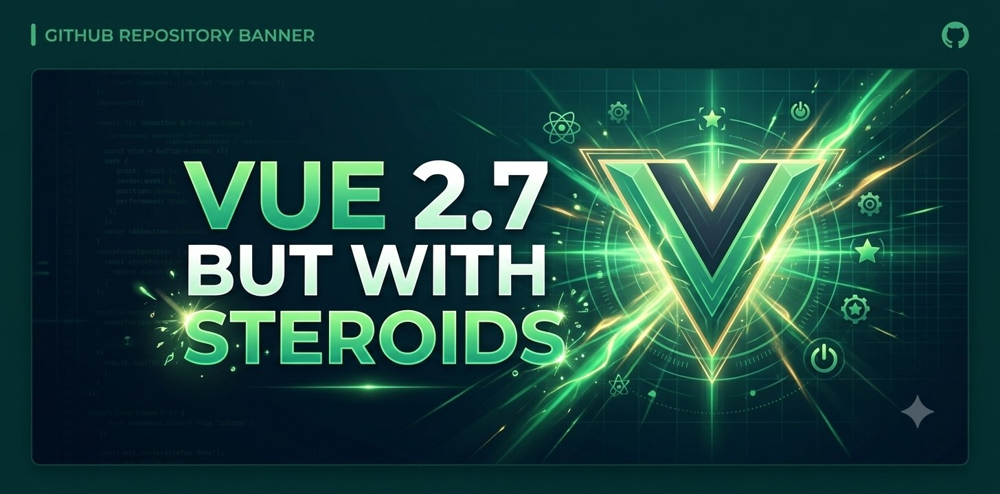

# Vue Steroids — Vue 2.7.16 Extended

> **🍴 Fork of [vuejs/vue](https://github.com/vuejs/vue) (v2.7.16) with built-in modern features.**

<p align="center">
  
</p>

<div align="center">


[Features](#features) • [Quick Start](#-quick-start) • [Documentation](#-documentation) • [Changelog](CHANGELOG.md)

</div>

---

## Overview

This fork extends Vue 2.7.16 with built-in HTTP client (axios), state management, WebSocket/Pusher RTC, router, portal/teleport, dynamic component loading, SSR bundling, HMR, storage manager, composables, and Vue 3 Composition API backport — eliminating the need for most third-party libraries while maintaining 100% backward compatibility.

---

## Features

### The Problem

Applications built on Vue 2 often require multiple third-party libraries for modern functionality:

| Requirement | Vanilla Vue 2 | Vue Steroids |
|-------------|---------------|--------------|
| HTTP Client | Install axios + setup per component | `this.get()`, `this.post()` — built-in |
| State Management | Install Vuex | `Vue.config.store` — built-in |
| Router | Install vue-router | `<router-view>` — built-in |
| Real-time Comms | Install pusher-js / laravel-echo | `this.$channel()` — built-in |
| Component Registry | Must register before `new Vue()` | `Vue.defineDynamicComponent()` — anytime |
| Lazy Loading | Manual dynamic imports with bundler | `asyncComponents` option |
| Teleport / Portal | Install portal-vue | `<Portal to="target">` — built-in |
| Composition API | Install `@vue/composition-api` | `ref`, `reactive`, `watch` — built-in |

### The Solution

All modern features are added directly into the Vue 2 source code without breaking any existing APIs:

| Feature | Vanilla Vue 2 | Vue Steroids |
|---------|---------------|--------------|
| HTTP Client | ❌ Install axios | ✅ **Built-in** (11 methods) |
| State Management | ❌ Install Vuex | ✅ **Built-in** (store, getters, mutations, actions) |
| Dynamic Components | ❌ Manual setup | ✅ **Auto-resolve** + register anytime |
| Lazy Loading | ❌ Complex config | ✅ **`asyncComponents` option** |
| Component Registry | ❌ Must before init | ✅ **`defineDynamicComponent()` anytime** |
| SSR Bundling | ❌ Not available | ✅ **Server-side component bundling** |
| HMR | ❌ Not available | ✅ **WebSocket hot reload** |

---

## ✨ New Features

### 1. 🌐 Built-in HTTP Client (Axios)

HTTP methods are available directly on every Vue instance — no separate import needed:

```javascript
new Vue({
  methods: {
    async getUsers() {
      return await this.get('/api/users')
    },
    
    async createUser(data) {
      return await this.post('/api/users', data)
    },
    
    async uploadFile(file) {
      return await this.postForm('/api/upload', { file })
    }
  }
})
```

**Features:**
- ✅ 11 HTTP methods (get, post, put, patch, delete, head, options, postForm, putForm, patchForm, request)
- ✅ Form data support (postForm, putForm, patchForm)
- ✅ Request/Response interceptors via `Vue.config`
- ✅ Auto token management (Authorization header)
- ✅ Error handling callbacks

📖 [Read full documentation →](docs/steroids-en/AXIOS_INTEGRATION.md)

---

### 2. 🏪 Built-in State Management

Vuex-like state management built-in — no separate package required:

```javascript
// 1. Configure store globally
Vue.config.store = {
  state: {
    count: 0,
    user: null
  },
  getters: {
    isLoggedIn: (state) => !!state.user
  },
  mutations: {
    INCREMENT(state) { state.count++ }
  },
  actions: {
    async fetchUser({ commit }, id) {
      const user = await this.get(`/api/users/${id}`)
      commit('SET_USER', user.data)
    }
  }
}

// 2. Use in components
new Vue({
  computed: {
    ...Vue.mapState(['count', 'user']),
    ...Vue.mapGetters(['isLoggedIn'])
  },
  methods: {
    ...Vue.mapMutations(['INCREMENT']),
    ...Vue.mapActions(['fetchUser'])
  }
})
```

**Features:**
- ✅ Reactive state with auto-update
- ✅ Getters for computed state
- ✅ Mutations for synchronous changes
- ✅ Actions for asynchronous operations
- ✅ Modules support with nesting
- ✅ Helper functions (mapState, mapGetters, mapMutations, mapActions)

📖 [Read full documentation →](docs/steroids-en/STATE_MANAGEMENT.md)

---

### 3. 🎨 Dynamic Component Registration

Register components **anytime** — even after Vue instance initialization:

```javascript
// Before: Must register before new Vue()
Vue.component('my-comp', { ... })
new Vue({ ... })

// After: Register at any time!
new Vue({ ... })

Vue.defineDynamicComponent('my-comp', {
  template: '<div>Hello!</div>'
})
```

**Features:**
- ✅ Register components anytime (before or after `new Vue()`)
- ✅ Auto `$forceUpdate()` on all active instances
- ✅ Supports kebab-case, camelCase, PascalCase
- ✅ Global registry shared across all instances

📖 [Read full documentation →](docs/steroids-en/DYNAMIC_COMPONENTS_PERFORMANCE.md)

---

### 4. 📦 Dynamic Component Loader via AJAX

Load `.tpl` component files from the server at runtime:

```javascript
new Vue({
  methods: {
    async loadComponent() {
      await this.fetchDynamicComponent(
        'input-text',
        '/components/input/input-text',
        'component-notfound'
      )
    }
  }
})
```

**Component File Format:**
```html
<!-- /components/input/input-text.tpl -->
<script>
module.exports = {
  data: () => ({ value: '' }),
  methods: {
    onChange(e) { this.value = e.target.value }
  }
}
</script>

<template>
  <input :value="value" @input="onChange" />
</template>
```

**Features:**
- ✅ Load from server via AJAX
- ✅ Auto-parses `<script>`, `<template>`, and `<style>` sections
- ✅ Auto-registers component globally
- ✅ Fallback component on load failure
- ✅ Success/error callbacks
- ✅ Batch loading support

📖 [Read full documentation →](docs/steroids-en/DYNAMIC_COMPONENT_LOADER.md)

---

### 5. 🔄 Auto-Resolve Components

Unregistered components are automatically fetched from the server when `autoFetchComponents` is enabled:

```html
<template>
  <div>
    <!-- Component not yet registered — Vue auto-fetches it -->
    <input-text></input-text>
    <!-- Fetches from: /components/input/input-text.tpl -->
  </div>
</template>
```

**Auto Path Generation:**
```
input-text      →  /components/input/input-text.tpl
button-primary  →  /components/button/button-primary.tpl
header          →  /components/header.tpl
```

**Features:**
- ✅ Auto-fetch unregistered components from server
- ✅ Auto-parse, register, and re-render
- ✅ Auto `$forceUpdate()` after registration
- ✅ Fallback component on failure
- ✅ Duplicate request prevention

📖 [Read full documentation →](docs/steroids-en/AUTO_RESOLVE_COMPONENTS.md)

---

### 6. ⚡ SSR Bundling (Server-Side Component Bundling)

Combine multiple `.tpl` component requests into a single JavaScript bundle from the server:

```javascript
// Enable SSR mode
Vue.config.serverSide = true
Vue.config.serverSideURL = 'http://localhost:8485/bundle'

// Async components are automatically batched
{
  asyncComponents: [
    '/path/to/heavy-chart',
    '/path/to/data-table',
    '/path/to/map-view'
  ]
}
```

**How it works:**
1. Client collects all unloaded component paths
2. Sends a single POST request to `serverSideURL`
3. Server responds with a JS bundle containing `Vue.defineDynamicComponent()` calls
4. Client injects and executes the bundle via **Fetch + Script Injection**
5. All components are registered instantly

**Features:**
- ✅ Batch multiple components in one request
- ✅ Smart caching — only requests components not yet loaded
- ✅ Dynamic Script Injection with `sourceURL` for DevTools debugging
- ✅ Fallback if bundle fails to load
- ✅ Compatible with the `asyncComponents` option

📖 [Read full documentation →](docs/steroids-en/CONFIGURATIONS.md#3-dynamic-component-loader)

---

## 🚀 Quick Start

### Installation

```bash
# Install via npm
npm install vue@2.7.16

# Or use CDN
<script src="https://unpkg.com/vue@2.7.16/dist/vue.js"></script>
```

### Basic Setup

```html
<!DOCTYPE html>
<html>
<head>
  <!-- Axios included — no separate import needed -->
  <script src="./vue.js"></script>
</head>
<body>
  <div id="app">
    <h1>Count: {{ count }}</h1>
    <button @click="increment">+1</button>
  </div>

  <script>
    // 1. Setup store (optional — no Vuex needed)
    Vue.config.store = {
      state: { count: 0 },
      mutations: {
        INCREMENT(state) { state.count++ }
      }
    }

    // 2. Create Vue instance
    new Vue({
      el: '#app',
      computed: {
        count() { return this.$store.state.count }
      },
      methods: {
        increment() {
          this.$store.commit('INCREMENT')
        },
        
        // HTTP request without importing axios
        async loadData() {
          const response = await this.get('/api/data')
          console.log(response.data)
        }
      }
    })
  </script>
</body>
</html>
```

---

## 📚 Documentation

| Topic | Description | Link |
|-------|-------------|------|
| **Full Configuration** | All configuration options reference | [Read →](docs/steroids-en/CONFIGURATIONS.md) |
| **State Management** | Built-in store (Vuex-like API) | [Read →](docs/steroids-en/STATE_MANAGEMENT.md) |
| **HTTP Client** | Axios integration details | [Read →](docs/steroids-en/AXIOS_INTEGRATION.md) |
| **Dynamic Components** | Register components anytime | [Read →](docs/steroids-en/DYNAMIC_COMPONENTS_PERFORMANCE.md) |
| **Component Loader** | Load .tpl components from server via AJAX | [Read →](docs/steroids-en/DYNAMIC_COMPONENT_LOADER.md) |
| **Auto-Resolve** | Automatic component fetching on demand | [Read →](docs/steroids-en/AUTO_RESOLVE_COMPONENTS.md) |
| **Build System** | Build pipeline, boilerplate generation, JS packing | [Read →](docs/steroids-en/BUILD_SYSTEM.md) |
| **SSR Bundler** | Server-Side component bundling server | [Read →](docs/steroids-en/SSR_BUNDLER.md) |
| **Performance** | Optimization tips | [Read →](docs/steroids-en/DYNAMIC_COMPONENTS_PERFORMANCE.md) |
| **Changelog** | All changes | [Read →](CHANGELOG.md) |

---

## 📊 Detailed Comparison: Vue 2.7 vs Vue Steroids

### Source Code Overview

| Aspect | Vue 2.7 (Default) | Vue Steroids (Fork) |
|--------|:-----------------:|:-------------------:|
| **Package** | `vue` by Evan You | `vue` (fork, modified) |
| **Repository** | [github.com/vuejs/vue](https://github.com/vuejs/vue) | [github.com/oneaxxall/vue-steroids](https://github.com/oneaxxall/vue-steroids) |
| **Runtime Dependencies** | ❌ **None** (zero dependency) | ✅ **Axios** (`axios@^1.14.0`) |
| **Bundle Size** | ~33kb (gzip) | ~90kb (gzip) — includes axios + additional features |

---

### ⚙️ Initialization & Instance

| Feature | Vue 2.7 (Default) | Vue Steroids | Notes |
|---------|:-----------------:|:------------:|-------|
| **Register component after `new Vue()`** | ❌ **Not possible** — must register with `Vue.component()` BEFORE `new Vue()`. | ✅ **Possible** — `Vue.defineDynamicComponent('name', { ... })` works anytime, auto `$forceUpdate()` on all instances. | **🔥 Primary problem solved.** |
| **Auto-Resolve unregistered components** | ❌ **None** — if `<input-text>` is used in template but not registered, Vue only shows a warning. | ✅ **Available** — when `Vue.config.autoFetchComponents = true`, Vue auto-fetches from server, parses, registers, and re-renders. | See `src/core/util/options.ts` — `defineDynamicComponent` |
| **Force update on component registration** | ❌ No automatic mechanism | ✅ All registered instances (`vueInstances[]`) auto `$forceUpdate()` when `defineDynamicComponent()` is called | See `src/core/instance/init.ts` — `registerVueInstance(vm)` |
| **Auto-injected store** | ❌ Must install & setup Vuex manually | ✅ `vm.$store` available if `Vue.config.store` or `vm.$options.store` is set | See `src/core/instance/init.ts` |
| **Async components (`asyncComponents` option)** | ❌ Not available | ✅ Load async components via `asyncComponents: ['/path/to/comp']` in options | See `src/core/util/dynamic-component-loader.ts` |
| **`$loading` reactive state** | ❌ Not available | ✅ `vm.$loading` is reactive and auto-defined for all instances | See `src/core/instance/state.ts` — `defineReactive(vm, '$loading', false)` |

---

### 🌐 HTTP Client (Axios)

| Feature | Vue 2.7 (Default) | Vue Steroids | Notes |
|---------|:-----------------:|:------------:|-------|
| **Built-in HTTP methods** | ❌ Must install `axios` & import in every file | ✅ `this.get()`, `this.post()`, `this.put()`, `this.patch()`, `this.delete()`, `this.head()`, `this.options()` on prototype | See `src/core/instance/http.ts` |
| **Form data methods** | ❌ Not available | ✅ `this.postForm()`, `this.putForm()`, `this.patchForm()` for file uploads | See `src/core/instance/http.ts` |
| **Global interceptors via config** | ❌ Must setup axios instance manually | ✅ `Vue.config.axiosRequestInterceptor`, `Vue.config.axiosResponseInterceptor`, etc. | See `src/core/config.ts` |
| **Auto token management** | ❌ Manual | ✅ `Vue.config.axiosToken` — auto-added to Authorization header | See `src/core/util/http.ts` |
| **Global headers** | ❌ Manual | ✅ `Vue.config.axiosHeaders` — custom global headers | See `src/core/util/http.ts` |
| **Global base URL** | ❌ Manual | ✅ `Vue.config.axiosBaseURL` — base URL for all requests | See `src/core/util/http.ts` |
| **Global timeout** | ❌ Manual | ✅ `Vue.config.axiosTimeout` — default timeout for all requests | See `src/core/util/http.ts` |
| **API Namespace (`api` option)** | ❌ Not available | ✅ Component option `api: { ... }` — HTTP methods namespaced under `this.api` | See `src/core/instance/state.ts` — `initApi()` |

---

### 🏪 State Management

| Feature | Vue 2.7 (Default) | Vue Steroids | Notes |
|---------|:-----------------:|:------------:|-------|
| **Built-in store (no Vuex)** | ❌ Must install `vuex` | ✅ `Vue.config.store = { state, getters, mutations, actions }` | See `src/core/util/store.ts` |
| **Helper functions** | ❌ Vuex only | ✅ `Vue.mapState()`, `Vue.mapGetters()`, `Vue.mapMutations()`, `Vue.mapActions()` | See `src/core/global-api/index.ts` |
| **Modules support** | ❌ Vuex only | ✅ Store modules with their own state/mutations | See `src/core/util/store.ts` |
| **Subscribers (Vuex plugins equivalent)** | ❌ Not available | ✅ `store.subscribe()` — callback on every mutation commit | See `src/core/util/store.ts` |

---

### 🧭 Routing

| Feature | Vue 2.7 (Default) | Vue Steroids | Notes |
|---------|:-----------------:|:------------:|-------|
| **Built-in router (no vue-router)** | ❌ Must install `vue-router` | ✅ Lightweight built-in router with `<router-view>` & `<router-link>` | See `src/core/util/router.ts` |
| **Reactive route object** | ❌ Vue-router only | ✅ `this.$route` reactive with path, query, hash, segments | See `src/core/util/router.ts` |
| **Layout support** | ❌ Vue-router only | ✅ Layout pages via `layout-{name}` components | See `src/core/util/router-components.ts` |
| **Route watchers** | ❌ Vue-router only | ✅ `Vue.config.router.watch = { '/path': callback }` | See `docs/steroids-en/ROUTE_WATCHERS.md` |

---

### ⚡ Real-Time Communication (RTC)

| Feature | Vue 2.7 (Default) | Vue Steroids | Notes |
|---------|:-----------------:|:------------:|-------|
| **WebSocket/Pusher built-in** | ❌ Must install `pusher-js` or `laravel-echo` | ✅ Native RTC Driver with Pusher/Reverb protocol support | See `src/core/util/rtc.ts` |
| **Global socket config** | ❌ Not available | ✅ `Vue.config.socket = { enabled, broadcaster, key, host, port, authEndpoint }` | See `src/core/config.ts` |
| **Channel methods on instance** | ❌ Not available | ✅ `this.$rtc.channel()`, `this.$rtc.private()`, `this.$rtc.presence()` | See `src/core/instance/rtc.ts` |

---

### 🧩 Dynamic Components & Loading

| Feature | Vue 2.7 (Default) | Vue Steroids | Notes |
|---------|:-----------------:|:------------:|-------|
| **Register component anytime** | ❌ **Must be before `new Vue()`** | ✅ `Vue.defineDynamicComponent()` — works after `new Vue()` | See `src/core/util/options.ts` |
| **Auto-fetch from server** | ❌ Not available | ✅ When `autoFetchComponents = true`, unregistered components are auto-fetched | See `src/core/util/options.ts` |
| **Dynamic Component Loader via AJAX** | ❌ Not available | ✅ `this.fetchDynamicComponent(name, path, fallback)` — load `.tpl` from server | See `src/core/util/dynamic-component-loader.ts` |
| **Loading directive (`v-loading`)** | ❌ Not available | ✅ `v-loading` with SVG spinner and blur overlay | See `src/core/directives/loading.ts` |
| **Loading template** | ❌ Not available | ✅ `loadingTemplate` option for async components | See `docs/steroids-en/LOAD_ASYNC_COMPONENT.md` |

---

### 🔧 Utilities & Others

| Feature | Vue 2.7 (Default) | Vue Steroids | Notes |
|---------|:-----------------:|:------------:|-------|
| **Portal / Teleport** | ❌ Not available | ✅ `<Portal to="target">` & `<PortalTarget name="target">` (Vue 3 Teleport-like) | See `src/core/util/portal.ts` |
| **Storage Manager** | ❌ Not available | ✅ `Vue.$storage.set()`, `Vue.$storage.get()`, `Vue.$storage.remove()` — with namespace & expiry | See `src/core/util/storage.ts` |
| **Built-in Hooks / Composables** | ❌ Not available | ✅ `this.onClickOutside(refName, handler)` — no extra library | See `src/core/util/hooks.ts` |
| **Standalone Reactive System** | ❌ Not available | ✅ `Vue.reactive(name, initialValue)` — reactive store outside components | See `src/core/util/reactive.ts` |
| **Browser `require()`** | ❌ Not available | ✅ `Vue.require()` / `Vue.requireAsync()` — dynamic JS module loading | See `src/core/util/require.ts` |
| **Composition API (Vue 3 backport)** | ⚠️ Limited (official Vue) | ✅ Same as Vue 2.7 (ref, reactive, computed, watch) | See `src/v3/` |
| **Mixins system** | ❌ Not available | ✅ `Vue.mixin()` custom | See `docs/steroids-en/MIXINS.md` |
| **XML Props parser** | ❌ Not available | ✅ Parse XML attributes into component props | See `docs/steroids-en/ODOO_XML_PARAMS.md` |

---

### 💥 Problems Solved

| Problem in Vanilla Vue 2 | Solution in Vue Steroids |
|--------------------------|--------------------------|
| Components must be registered BEFORE `new Vue()`. Late-loaded components cannot be resolved. | **`Vue.defineDynamicComponent()`** — register anytime, auto `$forceUpdate()` on all instances. |
| Unregistered components in templates only show a warning and are not rendered. | **Auto-Resolve** — auto-fetch from server, parse, register, and re-render. |
| HTTP client (axios) requires separate install and import in each file. | **Built-in HTTP** — 11 methods on `this` directly. |
| State management requires Vuex install, store setup, plugins, etc. | **Built-in Store** — just `Vue.config.store = {...}`. |
| Real-time communication requires pusher-js / laravel-echo install. | **Built-in RTC** — native WebSocket/Pusher support. |
| Routing requires vue-router install. | **Built-in Router** — `<router-view>` & `<router-link>` ready to use. |
| Teleport/Portal not available in Vue 2. | **Portal** — `<Portal to="target">` similar to Vue 3 Teleport. |
| Loading state management is manual. | **v-loading** directive + **$loading** reactive property. |
| LocalStorage management is manual. | **$storage** plugin — get/set/remove with expiry support. |

---

## 🎯 Use Cases

### Perfect For:

1. **Legacy Projects**
   - Already running on Vue 2
   - Difficult to migrate to Vue 3
   - Need modern features without full rewrite

2. **Rapid Prototyping**
   - Minimal setup required
   - All features built-in
   - Quick path to production

3. **Learning & Teaching**
   - Simple Options API
   - No need to learn Composition API first
   - Comprehensive documentation

4. **Enterprise Applications**
   - Stable and well-tested
   - No breaking changes
   - Long-term support

---

## 🍴 Fork Information

This project is a **fork of [vuejs/vue](https://github.com/vuejs/vue)** (Vue 2 v2.7.16).

### What "Fork" means

- ✅ **Source code** taken directly from the official Vue 2 repository (last commit before end-of-life)
- ✅ **New features** are added **on top of** the original Vue 2 code — no Vue 3 code is backported except the Composition API
- ✅ **100% backward compatible** — all original Vue 2 APIs work as expected
- ❌ **Not a re-write** — we did not rewrite Vue from scratch
- ❌ **Not Vue 3** — this is still Vue 2 with enhancements

### Source Code Changes

All modifications are made directly to the Vue 2 source code:

| Area | Changes |
|------|---------|
| `src/core/instance/` | Added `http.ts`, `rtc.ts` — HTTP & RTC methods on Vue prototype |
| `src/core/global-api/` | Init HTTP client, store, router, dynamic components, etc. |
| `src/core/util/` | Added `http.ts`, `store.ts`, `router.ts`, `rtc.ts`, `storage.ts`, `hooks.ts`, etc. |
| `src/v3/` | Composition API backport (ref, reactive, computed, watch) from Vue 3 |
| `package.json` | Added `axios` dependency, `workspace:*` for monorepo |

### Original Source

To view the original Vue 2 source code (without modifications):
- **GitHub**: [https://github.com/vuejs/vue](https://github.com/vuejs/vue)
- **Website**: [https://vuejs.org](https://vuejs.org)

---

## 🙏 Acknowledgments

### Special Thanks

**[Evan You](https://github.com/yyx990803)** - Creator of Vue.js

**Vue Core Team** — For years of maintenance and improvements

**Vue Community** — For contributions, plugins, and an amazing ecosystem

**You** — For using and loving Vue 2! 💚

---

## 🤝 Contributing

We welcome contributions! If you find a bug or have a feature request:

1. Fork the repository
2. Create a feature branch
3. Commit your changes
4. Push to the branch
5. Create a Pull Request

Or open an issue for discussion first.

---

## 📄 License

[MIT License](LICENSE) — Same as Vue 2

---

## 📬 Stay Connected

- **Star** this repository if you find it useful ⭐
- **Share** with other Vue 2 developers
- **Contribute** in any way you can

---

<div align="center">

[⬆ Back to Top](#vue-steroids--vue-2716-extended)

</div>
